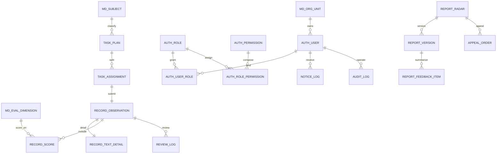

# 教师听课评课记录与分析系统数据库设计文档

**文档标识**：DBD-TObserver-V1.0  
**编写日期**：2026-04-18  
**适用项目**：教师听课评课记录与分析系统  
**对应文档**：

1. `doc/教师听课评课记录与分析系统需求规格说明书.md`
2. `doc/教师听课评课记录与分析系统系统架构设计文档.md`
3. `C:\Users\Wentao Qiu\Desktop\数据库开发设计规范.txt`

## 一、设计目标

本文档用于给出“教师听课评课记录与分析系统”的数据库详细设计方案，覆盖 MySQL 事务库设计、核心逻辑模型、物理表设计、索引策略、状态码约束、审计与归档要求，并为后续 DDL、Mapper、接口和测试设计提供一致基线。

数据库设计目标如下：

1. 支撑“任务发布 -> 听课填报 -> 审核退回/通过 -> 汇总分析 -> 结果发布 -> 申诉复核 -> 周期归档”的完整业务闭环。
2. 满足 FR-01 至 FR-12 与 BR-01 至 BR-08 的数据落库要求。
3. 符合《数据库开发设计规范》中关于命名、字段、索引、SQL、安全与生命周期管理的要求。
4. 在当前模块化单体架构下保持三范式优先，同时对高频查询适度反范式以换取性能。
5. 保证关键状态变化、导出、申诉、复核、归档均具备可审计、可追踪能力。

## 二、设计依据与约束

### 2.1 业务依据

依据需求和架构文档，系统数据库必须显式支撑以下业务对象：

1. 用户、角色、权限、组织、学科、评课维度等基础数据。
2. 听课任务主单与听课人分配明细。
3. 听课记录主表、评分明细、文本详情。
4. 审核日志、分析报告、报告版本、优缺点汇总项。
5. 申诉复核、通知发送记录、审计日志。

### 2.2 外部规范落地

结合《数据库开发设计规范》，本设计采用以下落地原则：

1. 数据库名、表名、列名全部采用小写加下划线风格。
2. 表名按模块前缀组织：`auth_`、`md_`、`task_`、`record_`、`review_`、`report_`、`appeal_`、`notice_`、`audit_`。
3. 所有业务表显式指定 `ENGINE=InnoDB`、`CHARSET=utf8mb4`、`COMMENT`。
4. 主键统一使用 `id bigint unsigned auto_increment`。
5. 绝大数字段采用 `NOT NULL`，通过默认值避免空值扩散。
6. 禁止存储明文密码，本系统仅保存统一认证后的用户映射信息。
7. 不在数据库中存储图片、附件等二进制内容，只保存文件地址或外部对象标识。
8. 尽量避免物理外键，引用完整性由应用层与唯一约束共同保证，降低死锁风险。
9. 单表索引数量控制在合理范围内，优先联合索引，避免冗余索引。
10. 关键状态变更与业务写操作必须与审计日志同事务提交。

### 2.3 设计假设

1. 用户、组织、教师基础资料由外部统一身份认证/组织系统同步，本库保留业务运行所需快照。
2. 一项听课任务可能同时分配给多个教研成员，因此采用“任务主表 + 分配明细表”的结构，而不是单表存一个听课人。
3. 首版不落地附件表；若后续需要上传附件，建议新增 `record_attachment`，仅保存对象存储路径。
4. 首版报表导出日志复用 `audit_log`，不单独拆分导出日志表。

## 三、数据库总体方案

### 3.1 数据库命名

- 数据库名：`t_observer_core`
- 字符集：`utf8mb4`
- 排序规则：`utf8mb4_0900_ai_ci`
- 存储引擎：`InnoDB`

建议初始化语句如下：

```sql
CREATE DATABASE t_observer_core
  DEFAULT CHARACTER SET utf8mb4
  DEFAULT COLLATE utf8mb4_0900_ai_ci;
```

### 3.2 数据分层

| 数据类别                     | 存储介质        | 说明          |
| ------------------------ | ----------- | ----------- |
| 用户、组织、任务、记录、审核、报告、申诉、日志  | MySQL 8.x   | 核心事务数据      |
| 登录态、权限缓存、字典缓存、热点分析结果、幂等键 | Redis       | 提升读取与提交保护能力 |
| 导出文件、附件文件                | 文件服务 / 对象存储 | 数据库仅保存路径    |

### 3.3 时间字段策略

外部规范对 `timestamp` 与 `datetime` 的建议存在不一致。本项目统一采用 `datetime` 保存业务时间，原因如下：

1. 需求文档中的 `lesson_date`、申诉时限、提交流转时间均属于明确业务时间点。
2. `datetime` 不受时区自动转换影响，更适合教学业务按本地时间解释。
3. MySQL 8 下 `datetime` 已可满足本项目首版性能与精度要求。

因此本文档中：

1. `lesson_date`、`submit_deadline`、`submitted_at`、`published_at` 等统一用 `datetime`。
2. `create_time`、`update_time` 也统一用 `datetime`，保持风格一致。

## 四、概念模型

### 4.1 业务域划分

| 业务域   | 说明               |
| ----- | ---------------- |
| 认证权限域 | 用户、角色、权限、角色授权    |
| 主数据域  | 组织、学科、评课维度       |
| 听课任务域 | 听课任务主单、成员分配      |
| 听课记录域 | 记录主表、文本详情、评分明细   |
| 审核归档域 | 审核动作轨迹、状态流转      |
| 分析报告域 | 雷达图报告、版本、优缺点汇总项  |
| 申诉复核域 | 申诉单、复核结果、修正版报告关联 |
| 通知审计域 | 通知发送记录、关键操作审计日志  |

### 4.2 核心实体关系



## 五、逻辑模型设计

### 5.1 表清单

| 序号  | 表名                     | 业务域  | 说明        | 规模预估      |
| --- | ---------------------- | ---- | --------- | --------- |
| 1   | `auth_user`            | 认证权限 | 用户主数据快照   | < 1 万     |
| 2   | `auth_role`            | 认证权限 | 角色定义      | < 100     |
| 3   | `auth_permission`      | 认证权限 | 权限点定义     | < 500     |
| 4   | `auth_user_role`       | 认证权限 | 用户角色关联    | < 5 万     |
| 5   | `auth_role_permission` | 认证权限 | 角色权限关联    | < 2 万     |
| 6   | `md_org_unit`          | 主数据  | 教研组/组织单元  | < 1 万     |
| 7   | `md_subject`           | 主数据  | 学科字典      | < 200     |
| 8   | `md_eval_dimension`    | 主数据  | 评课维度字典    | < 100     |
| 9   | `task_plan`            | 听课任务 | 听课任务主单    | 年 < 5 万   |
| 10  | `task_assignment`      | 听课任务 | 听课人分配明细   | 年 < 20 万  |
| 11  | `record_observation`   | 听课记录 | 听课记录主表    | 年 < 20 万  |
| 12  | `record_text_detail`   | 听课记录 | 长文本详情     | 年 < 20 万  |
| 13  | `record_score`         | 听课记录 | 评分明细      | 年 < 100 万 |
| 14  | `review_log`           | 审核归档 | 审核与归档轨迹   | 年 < 40 万  |
| 15  | `report_radar`         | 分析报告 | 当前有效报告    | 年 < 5 万   |
| 16  | `report_version`       | 分析报告 | 历史版本快照    | 年 < 10 万  |
| 17  | `report_feedback_item` | 分析报告 | 优点/待改进项汇总 | 年 < 30 万  |
| 18  | `appeal_order`         | 申诉复核 | 申诉与复核单据   | 年 < 2 万   |
| 19  | `notice_log`           | 通知审计 | 通知发送结果    | 年 < 30 万  |
| 20  | `audit_log`            | 通知审计 | 全量审计日志    | 年 < 100 万 |

### 5.2 关键关系说明

1. `task_plan` 表示一次听课任务主单，描述被听课教师、课程实例、截止时间等。
2. `task_assignment` 表示任务对具体观察人的分配明细，一条分配仅允许绑定一条当前记录。
3. `record_observation` 是记录主表；长文本拆到 `record_text_detail`，评分拆到 `record_score`。
4. `review_log` 记录审核通过、退回、归档等动作。
5. `report_radar` 保存当前有效报告快照；`report_version` 保存版本历史。
6. `appeal_order` 关联报告版本，支持申诉后生成修正版报告。
7. `audit_log` 用于落地 BR-08 与 FR-12，所有关键状态变更需要同步写入。

## 六、物理表设计

> 说明：以下为 MySQL 8 物理模型建议。除日志表外，业务表默认包含 `create_time`、`update_time`。  
> 说明：文档中的“逻辑关联”表示应用层维护的关联关系，不在数据库层建立外键。

### 6.1 `auth_user`

表用途：保存统一认证后在本系统内可用的用户快照，不存储密码。

| 字段名             | 类型              | 非空  | 默认值               | 约束/索引                     | 说明        |
| --------------- | --------------- | --- | ----------------- | ------------------------- | --------- |
| `id`            | bigint unsigned | 是   | 自增                | PK                        | 自增主键      |
| `user_id`       | bigint unsigned | 是   |                   | UK `uk_user_uid`          | 外部统一用户标识  |
| `username`      | varchar(64)     | 是   | `''`              |                           | 登录名/工号    |
| `real_name`     | varchar(64)     | 是   | `''`              |                           | 姓名        |
| `mobile`        | varchar(32)     | 是   | `''`              |                           | 手机号，展示需脱敏 |
| `email`         | varchar(128)    | 是   | `''`              |                           | 邮箱        |
| `org_unit_id`   | bigint unsigned | 是   | `0`               | IDX `idx_user_org_status` | 所属组织单元    |
| `user_status`   | varchar(32)     | 是   | `'ACTIVE'`        |                           | 用户状态      |
| `source_system` | varchar(32)     | 是   | `'SSO'`           |                           | 来源系统      |
| `last_login_at` | datetime        | 否   | `NULL`            |                           | 最近登录时间    |
| `create_time`   | datetime        | 是   | CURRENT_TIMESTAMP |                           | 创建时间      |
| `update_time`   | datetime        | 是   | CURRENT_TIMESTAMP |                           | 更新时间      |

索引建议：

1. `uk_user_uid(user_id)`
2. `idx_user_org_status(org_unit_id, user_status)`
3. `idx_user_real_name(real_name)`

### 6.2 `auth_role`

| 字段名           | 类型              | 非空  | 默认值               | 约束/索引             | 说明   |
| ------------- | --------------- | --- | ----------------- | ----------------- | ---- |
| `id`          | bigint unsigned | 是   | 自增                | PK                | 主键   |
| `role_code`   | varchar(32)     | 是   |                   | UK `uk_role_code` | 角色编码 |
| `role_name`   | varchar(64)     | 是   | `''`              |                   | 角色名称 |
| `role_scope`  | varchar(32)     | 是   | `'SYSTEM'`        |                   | 角色范围 |
| `role_status` | varchar(32)     | 是   | `'ACTIVE'`        |                   | 角色状态 |
| `create_time` | datetime        | 是   | CURRENT_TIMESTAMP |                   | 创建时间 |
| `update_time` | datetime        | 是   | CURRENT_TIMESTAMP |                   | 更新时间 |

### 6.3 `auth_permission`

| 字段名                 | 类型              | 非空  | 默认值               | 约束/索引             | 说明                |
| ------------------- | --------------- | --- | ----------------- | ----------------- | ----------------- |
| `id`                | bigint unsigned | 是   | 自增                | PK                | 主键                |
| `permission_code`   | varchar(64)     | 是   |                   | UK `uk_perm_code` | 权限编码              |
| `permission_name`   | varchar(64)     | 是   | `''`              |                   | 权限名称              |
| `permission_type`   | varchar(32)     | 是   | `'API'`           |                   | `MENU/BUTTON/API` |
| `resource_path`     | varchar(255)    | 是   | `''`              |                   | 资源路径              |
| `http_method`       | varchar(16)     | 是   | `''`              |                   | 请求方法              |
| `permission_status` | varchar(32)     | 是   | `'ACTIVE'`        |                   | 权限状态              |
| `create_time`       | datetime        | 是   | CURRENT_TIMESTAMP |                   | 创建时间              |
| `update_time`       | datetime        | 是   | CURRENT_TIMESTAMP |                   | 更新时间              |

### 6.4 `auth_user_role`

| 字段名           | 类型              | 非空  | 默认值               | 约束/索引             | 说明                       |
| ------------- | --------------- | --- | ----------------- | ----------------- | ------------------------ |
| `id`          | bigint unsigned | 是   | 自增                | PK                | 主键                       |
| `user_id`     | bigint unsigned | 是   |                   | UK `uk_user_role` | 逻辑关联 `auth_user.user_id` |
| `role_id`     | bigint unsigned | 是   |                   | UK `uk_user_role` | 逻辑关联 `auth_role.id`      |
| `create_time` | datetime        | 是   | CURRENT_TIMESTAMP |                   | 创建时间                     |
| `update_time` | datetime        | 是   | CURRENT_TIMESTAMP |                   | 更新时间                     |

索引建议：

1. `uk_user_role(user_id, role_id)`
2. `idx_user_role_role(role_id)`

### 6.5 `auth_role_permission`

| 字段名             | 类型              | 非空  | 默认值               | 约束/索引             | 说明                        |
| --------------- | --------------- | --- | ----------------- | ----------------- | ------------------------- |
| `id`            | bigint unsigned | 是   | 自增                | PK                | 主键                        |
| `role_id`       | bigint unsigned | 是   |                   | UK `uk_role_perm` | 逻辑关联 `auth_role.id`       |
| `permission_id` | bigint unsigned | 是   |                   | UK `uk_role_perm` | 逻辑关联 `auth_permission.id` |
| `create_time`   | datetime        | 是   | CURRENT_TIMESTAMP |                   | 创建时间                      |
| `update_time`   | datetime        | 是   | CURRENT_TIMESTAMP |                   | 更新时间                      |

### 6.6 `md_org_unit`

表用途：保存学校组织、教研组、年级组等结构。

| 字段名                  | 类型              | 非空  | 默认值               | 约束/索引                     | 说明                   |
| -------------------- | --------------- | --- | ----------------- | ------------------------- | -------------------- |
| `id`                 | bigint unsigned | 是   | 自增                | PK                        | 主键                   |
| `org_unit_id`        | bigint unsigned | 是   |                   | UK `uk_org_oid`           | 外部组织标识               |
| `parent_org_unit_id` | bigint unsigned | 是   | `0`               | IDX `idx_org_parent_sort` | 父级组织                 |
| `org_name`           | varchar(128)    | 是   | `''`              |                           | 组织名称                 |
| `org_type`           | varchar(32)     | 是   | `'GROUP'`         |                           | `SCHOOL/GROUP/GRADE` |
| `subject_code`       | varchar(32)     | 是   | `''`              |                           | 归属学科，可为空串            |
| `leader_user_id`     | bigint unsigned | 是   | `0`               |                           | 组长用户标识               |
| `org_status`         | varchar(32)     | 是   | `'ACTIVE'`        |                           | 组织状态                 |
| `sort_no`            | int unsigned    | 是   | `0`               | IDX `idx_org_parent_sort` | 排序号                  |
| `create_time`        | datetime        | 是   | CURRENT_TIMESTAMP |                           | 创建时间                 |
| `update_time`        | datetime        | 是   | CURRENT_TIMESTAMP |                           | 更新时间                 |

### 6.7 `md_subject`

| 字段名              | 类型              | 非空  | 默认值               | 约束/索引                | 说明   |
| ---------------- | --------------- | --- | ----------------- | -------------------- | ---- |
| `id`             | bigint unsigned | 是   | 自增                | PK                   | 主键   |
| `subject_code`   | varchar(32)     | 是   |                   | UK `uk_subject_code` | 学科编码 |
| `subject_name`   | varchar(64)     | 是   | `''`              |                      | 学科名称 |
| `subject_status` | varchar(32)     | 是   | `'ACTIVE'`        |                      | 状态   |
| `sort_no`        | int unsigned    | 是   | `0`               |                      | 排序   |
| `create_time`    | datetime        | 是   | CURRENT_TIMESTAMP |                      | 创建时间 |
| `update_time`    | datetime        | 是   | CURRENT_TIMESTAMP |                      | 更新时间 |

### 6.8 `md_eval_dimension`

表用途：定义雷达图和评分计算维度。

| 字段名                | 类型               | 非空  | 默认值               | 约束/索引                     | 说明      |
| ------------------ | ---------------- | --- | ----------------- | ------------------------- | ------- |
| `id`               | bigint unsigned  | 是   | 自增                | PK                        | 主键      |
| `dimension_code`   | varchar(32)      | 是   |                   | UK `uk_dim_code`          | 维度编码    |
| `dimension_name`   | varchar(64)      | 是   | `''`              |                           | 维度名称    |
| `dimension_desc`   | varchar(512)     | 是   | `''`              |                           | 维度说明    |
| `score_weight`     | decimal(5,2)     | 是   | `1.00`            |                           | 维度权重    |
| `min_score`        | decimal(2,1)     | 是   | `1.0`             |                           | 最小分     |
| `max_score`        | decimal(2,1)     | 是   | `5.0`             |                           | 最大分     |
| `score_step`       | decimal(2,1)     | 是   | `0.5`             |                           | 步长      |
| `is_radar_enabled` | tinyint unsigned | 是   | `1`               |                           | 是否参与雷达图 |
| `dimension_status` | varchar(32)      | 是   | `'ACTIVE'`        |                           | 状态      |
| `sort_no`          | int unsigned     | 是   | `0`               | IDX `idx_dim_status_sort` | 排序      |
| `create_time`      | datetime         | 是   | CURRENT_TIMESTAMP |                           | 创建时间    |
| `update_time`      | datetime         | 是   | CURRENT_TIMESTAMP |                           | 更新时间    |

### 6.9 `task_plan`

表用途：听课任务主单，一条任务对应一个课程实例与一个被听课教师，可拆分多个观察人。

| 字段名                    | 类型              | 非空  | 默认值               | 约束/索引                        | 说明       |
| ---------------------- | --------------- | --- | ----------------- | ---------------------------- | -------- |
| `id`                   | bigint unsigned | 是   | 自增                | PK                           | 主键       |
| `task_code`            | varchar(32)     | 是   |                   | UK `uk_task_code`            | 任务编号     |
| `task_name`            | varchar(128)    | 是   | `''`              |                              | 任务名称     |
| `org_unit_id`          | bigint unsigned | 是   | `0`               | IDX `idx_task_org_status`    | 教研组      |
| `leader_user_id`       | bigint unsigned | 是   | `0`               | IDX `idx_task_leader_status` | 任务负责人    |
| `teacher_user_id`      | bigint unsigned | 是   | `0`               | IDX `idx_task_teacher_date`  | 被听课教师    |
| `subject_code`         | varchar(32)     | 是   | `''`              |                              | 学科编码     |
| `grade_name`           | varchar(64)     | 是   | `''`              |                              | 年级       |
| `class_name`           | varchar(64)     | 是   | `''`              |                              | 班级       |
| `course_name`          | varchar(128)    | 是   | `''`              |                              | 课程名称     |
| `lesson_instance_code` | varchar(64)     | 是   |                   | UK `uk_task_lesson`          | 课程实例编码   |
| `lesson_date`          | datetime        | 是   |                   | IDX `idx_task_teacher_date`  | 听课时间     |
| `submit_deadline`      | datetime        | 是   |                   |                              | 提交截止时间   |
| `rectify_deadline`     | datetime        | 是   |                   |                              | 退回整改截止时间 |
| `task_status`          | varchar(32)     | 是   | `'DRAFT'`         |                              | 任务状态     |
| `publish_at`           | datetime        | 否   | `NULL`            |                              | 发布时间     |
| `archived_at`          | datetime        | 否   | `NULL`            |                              | 归档时间     |
| `remark`               | varchar(500)    | 是   | `''`              |                              | 备注       |
| `create_time`          | datetime        | 是   | CURRENT_TIMESTAMP |                              | 创建时间     |
| `update_time`          | datetime        | 是   | CURRENT_TIMESTAMP |                              | 更新时间     |

索引建议：

1. `uk_task_code(task_code)`
2. `uk_task_lesson(teacher_user_id, lesson_instance_code)`
3. `idx_task_leader_status(leader_user_id, task_status)`
4. `idx_task_teacher_date(teacher_user_id, lesson_date)`
5. `idx_task_org_status(org_unit_id, task_status)`

### 6.10 `task_assignment`

表用途：任务分配明细，一条记录对应一个听课人执行视角。

| 字段名                    | 类型              | 非空  | 默认值               | 约束/索引                            | 说明                  |
| ---------------------- | --------------- | --- | ----------------- | -------------------------------- | ------------------- |
| `id`                   | bigint unsigned | 是   | 自增                | PK                               | 主键                  |
| `task_plan_id`         | bigint unsigned | 是   |                   | UK `uk_assign_plan_observer`     | 逻辑关联 `task_plan.id` |
| `observer_user_id`     | bigint unsigned | 是   |                   | UK `uk_assign_plan_observer`     | 听课人                 |
| `lesson_instance_code` | varchar(64)     | 是   | `''`              | UK `uk_assign_observer_lesson`   | 冗余课程实例编码            |
| `assignment_status`    | varchar(32)     | 是   | `'ASSIGNED'`      | IDX `idx_assign_observer_status` | 分配状态                |
| `receive_at`           | datetime        | 否   | `NULL`            |                                  | 接收时间                |
| `submitted_at`         | datetime        | 否   | `NULL`            | IDX `idx_assign_status_submit`   | 提交时间                |
| `approved_at`          | datetime        | 否   | `NULL`            |                                  | 审核通过时间              |
| `archived_at`          | datetime        | 否   | `NULL`            |                                  | 归档时间                |
| `remind_count`         | int unsigned    | 是   | `0`               |                                  | 提醒次数                |
| `last_remind_at`       | datetime        | 否   | `NULL`            |                                  | 最近提醒时间              |
| `create_time`          | datetime        | 是   | CURRENT_TIMESTAMP |                                  | 创建时间                |
| `update_time`          | datetime        | 是   | CURRENT_TIMESTAMP |                                  | 更新时间                |

关键约束：

1. `uk_assign_plan_observer(task_plan_id, observer_user_id)`，防止同一任务重复分配。
2. `uk_assign_observer_lesson(observer_user_id, lesson_instance_code)`，落实 BR-02，防止同一听课人对同一课程实例生成多条有效执行单。

### 6.11 `record_observation`

表用途：听课记录主表，保存状态、归属关系和摘要信息。

| 字段名                  | 类型               | 非空  | 默认值               | 约束/索引                           | 说明                        |
| -------------------- | ---------------- | --- | ----------------- | ------------------------------- | ------------------------- |
| `id`                 | bigint unsigned  | 是   | 自增                | PK                              | 主键                        |
| `record_no`          | varchar(32)      | 是   |                   | UK `uk_record_no`               | 记录编号                      |
| `assignment_id`      | bigint unsigned  | 是   |                   | UK `uk_record_assignment`       | 逻辑关联 `task_assignment.id` |
| `task_plan_id`       | bigint unsigned  | 是   | `0`               | IDX `idx_record_teacher_status` | 冗余任务主键                    |
| `observer_user_id`   | bigint unsigned  | 是   | `0`               |                                 | 听课人                       |
| `teacher_user_id`    | bigint unsigned  | 是   | `0`               | IDX `idx_record_teacher_status` | 被听课教师                     |
| `record_status`      | varchar(32)      | 是   | `'DRAFT'`         | IDX `idx_record_status_time`    | 记录状态                      |
| `submit_version`     | int unsigned     | 是   | `0`               |                                 | 提交版本号                     |
| `is_overtime_submit` | tinyint unsigned | 是   | `0`               |                                 | 是否超时提交                    |
| `overdue_reason`     | varchar(500)     | 是   | `''`              |                                 | 逾期原因                      |
| `return_reason`      | varchar(1000)    | 是   | `''`              |                                 | 最近一次退回原因                  |
| `submitted_at`       | datetime         | 否   | `NULL`            | IDX `idx_record_status_time`    | 提交时间                      |
| `returned_at`        | datetime         | 否   | `NULL`            |                                 | 退回时间                      |
| `approved_at`        | datetime         | 否   | `NULL`            |                                 | 通过时间                      |
| `archived_at`        | datetime         | 否   | `NULL`            |                                 | 归档时间                      |
| `create_time`        | datetime         | 是   | CURRENT_TIMESTAMP |                                 | 创建时间                      |
| `update_time`        | datetime         | 是   | CURRENT_TIMESTAMP |                                 | 更新时间                      |

设计说明：

1. 主表不直接承载长文本，避免高频列表查询扫描大字段。
2. `submit_version` 用于记录退回后再次提交次数。
3. `return_reason` 做当前态冗余，完整轨迹仍以 `review_log` 为准。

### 6.12 `record_text_detail`

表用途：拆分保存优点项、待改进项、建议等长文本。

| 字段名               | 类型              | 非空  | 默认值               | 约束/索引               | 说明                           |
| ----------------- | --------------- | --- | ----------------- | ------------------- | ---------------------------- |
| `id`              | bigint unsigned | 是   | 自增                | PK                  | 主键                           |
| `record_id`       | bigint unsigned | 是   |                   | UK `uk_text_record` | 逻辑关联 `record_observation.id` |
| `strengths_text`  | text            | 是   |                   |                     | 优点项文本                        |
| `weaknesses_text` | text            | 是   |                   |                     | 待改进项文本                       |
| `suggestion_text` | text            | 是   |                   |                     | 改进建议文本                       |
| `create_time`     | datetime        | 是   | CURRENT_TIMESTAMP |                     | 创建时间                         |
| `update_time`     | datetime        | 是   | CURRENT_TIMESTAMP |                     | 更新时间                         |

设计说明：

1. 虽然规范建议谨慎使用 `TEXT`，但本业务存在较长评语文本，拆表后可兼顾规范与性能。
2. 列表页默认不查此表，详情页按 `record_id` 单点查询。

### 6.13 `record_score`

表用途：保存单条听课记录下各评课维度分值。

| 字段名              | 类型              | 非空  | 默认值               | 约束/索引                    | 说明                                      |
| ---------------- | --------------- | --- | ----------------- | ------------------------ | --------------------------------------- |
| `id`             | bigint unsigned | 是   | 自增                | PK                       | 主键                                      |
| `record_id`      | bigint unsigned | 是   |                   | UK `uk_score_record_dim` | 逻辑关联 `record_observation.id`            |
| `dimension_code` | varchar(32)     | 是   |                   | UK `uk_score_record_dim` | 逻辑关联 `md_eval_dimension.dimension_code` |
| `score_value`    | decimal(2,1)    | 是   | `1.0`             | IDX `idx_score_dim`      | 评分值                                     |
| `create_time`    | datetime        | 是   | CURRENT_TIMESTAMP |                          | 创建时间                                    |
| `update_time`    | datetime        | 是   | CURRENT_TIMESTAMP |                          | 更新时间                                    |

关键约束：

1. `uk_score_record_dim(record_id, dimension_code)`，防止同一维度重复打分。
2. `score_value` 必须由应用层校验为 `1.0 ~ 5.0`，且步长 `0.5`。

### 6.14 `review_log`

表用途：记录审核通过、退回、归档等动作轨迹。

| 字段名                | 类型              | 非空  | 默认值               | 约束/索引                          | 说明                           |
| ------------------ | --------------- | --- | ----------------- | ------------------------------ | ---------------------------- |
| `id`               | bigint unsigned | 是   | 自增                | PK                             | 主键                           |
| `record_id`        | bigint unsigned | 是   |                   | IDX `idx_review_record_time`   | 逻辑关联 `record_observation.id` |
| `review_round`     | int unsigned    | 是   | `1`               |                                | 第几轮审核                        |
| `reviewer_user_id` | bigint unsigned | 是   | `0`               | IDX `idx_review_reviewer_time` | 审核人                          |
| `action_code`      | varchar(32)     | 是   | `''`              |                                | `RETURN/APPROVE/ARCHIVE`     |
| `before_status`    | varchar(32)     | 是   | `''`              |                                | 变更前状态                        |
| `after_status`     | varchar(32)     | 是   | `''`              |                                | 变更后状态                        |
| `review_reason`    | varchar(1000)   | 是   | `''`              |                                | 审核意见或退回原因                    |
| `create_time`      | datetime        | 是   | CURRENT_TIMESTAMP |                                | 操作时间                         |

设计说明：

1. 退回动作必须填写 `review_reason`，落实 BR-06。
2. `review_round` 与 `record_observation.submit_version` 组合可还原退回重提过程。

### 6.15 `report_radar`

表用途：保存某教师某周期的当前有效分析报告快照。

| 字段名                    | 类型               | 非空  | 默认值               | 约束/索引                           | 说明        |
| ---------------------- | ---------------- | --- | ----------------- | ------------------------------- | --------- |
| `id`                   | bigint unsigned  | 是   | 自增                | PK                              | 主键        |
| `report_no`            | varchar(32)      | 是   |                   | UK `uk_report_no`               | 报告编号      |
| `teacher_user_id`      | bigint unsigned  | 是   | `0`               | UK `uk_report_period`           | 被听课教师     |
| `org_unit_id`          | bigint unsigned  | 是   | `0`               |                                 | 组织单元      |
| `subject_code`         | varchar(32)      | 是   | `''`              |                                 | 学科编码      |
| `period_type`          | varchar(32)      | 是   | `'CUSTOM'`        | UK `uk_report_period`           | 周期类型      |
| `period_start`         | date             | 是   |                   | UK `uk_report_period`           | 周期开始      |
| `period_end`           | date             | 是   |                   | UK `uk_report_period`           | 周期结束      |
| `sample_count`         | int unsigned     | 是   | `0`               |                                 | 样本数量      |
| `is_sample_sufficient` | tinyint unsigned | 是   | `0`               |                                 | 是否满足最小样本量 |
| `current_version_no`   | int unsigned     | 是   | `1`               |                                 | 当前版本号     |
| `report_status`        | varchar(32)      | 是   | `'GENERATED'`     | IDX `idx_report_teacher_status` | 报告状态      |
| `conclusion_text`      | varchar(2000)    | 是   | `''`              |                                 | 当前结论摘要    |
| `radar_json`           | json             | 否   | `NULL`            |                                 | 当前雷达图数据   |
| `generated_at`         | datetime         | 是   | CURRENT_TIMESTAMP |                                 | 生成时间      |
| `published_at`         | datetime         | 否   | `NULL`            |                                 | 发布时间      |
| `create_time`          | datetime         | 是   | CURRENT_TIMESTAMP |                                 | 创建时间      |
| `update_time`          | datetime         | 是   | CURRENT_TIMESTAMP |                                 | 更新时间      |

关键约束：

1. `uk_report_period(teacher_user_id, period_type, period_start, period_end)`，保证同周期仅一份当前报告主体。
2. 当 `sample_count < 3` 时，`is_sample_sufficient=0` 且 `radar_json` 允许为空，落实 BR-05。

### 6.16 `report_version`

表用途：保存报告的历史版本，用于申诉修正、重新发布与审计追踪。

| 字段名                    | 类型               | 非空  | 默认值               | 约束/索引                        | 说明                     |
| ---------------------- | ---------------- | --- | ----------------- | ---------------------------- | ---------------------- |
| `id`                   | bigint unsigned  | 是   | 自增                | PK                           | 主键                     |
| `report_id`            | bigint unsigned  | 是   |                   | UK `uk_report_ver`           | 逻辑关联 `report_radar.id` |
| `version_no`           | int unsigned     | 是   | `1`               | UK `uk_report_ver`           | 版本号                    |
| `sample_count`         | int unsigned     | 是   | `0`               |                              | 样本数                    |
| `is_sample_sufficient` | tinyint unsigned | 是   | `0`               |                              | 是否样本充足                 |
| `change_reason`        | varchar(500)     | 是   | `''`              |                              | 版本变更原因                 |
| `conclusion_text`      | varchar(2000)    | 是   | `''`              |                              | 版本结论                   |
| `radar_json`           | json             | 否   | `NULL`            |                              | 版本雷达图数据                |
| `generated_by`         | bigint unsigned  | 是   | `0`               |                              | 生成/修正操作人               |
| `published_at`         | datetime         | 否   | `NULL`            |                              | 版本发布时间                 |
| `is_current`           | tinyint unsigned | 是   | `1`               | IDX `idx_report_ver_current` | 是否当前版本                 |
| `create_time`          | datetime         | 是   | CURRENT_TIMESTAMP |                              | 创建时间                   |
| `update_time`          | datetime         | 是   | CURRENT_TIMESTAMP |                              | 更新时间                   |

设计说明：

1. 申诉复核修正后新增版本，不覆盖旧版本，落实 EX-06。
2. `report_radar` 仅保存当前快照，历史追踪统一以本表为准。

### 6.17 `report_feedback_item`

表用途：保存报告中汇总后的优点项与待改进项。

| 字段名                 | 类型              | 非空  | 默认值               | 约束/索引                       | 说明                       |
| ------------------- | --------------- | --- | ----------------- | --------------------------- | ------------------------ |
| `id`                | bigint unsigned | 是   | 自增                | PK                          | 主键                       |
| `report_version_id` | bigint unsigned | 是   |                   | IDX `idx_feedback_ver_type` | 逻辑关联 `report_version.id` |
| `item_type`         | varchar(32)     | 是   | `''`              | IDX `idx_feedback_ver_type` | `STRENGTH/WEAKNESS`      |
| `item_content`      | varchar(1000)   | 是   | `''`              |                             | 汇总内容                     |
| `source_count`      | int unsigned    | 是   | `0`               |                             | 来源条数                     |
| `order_no`          | int unsigned    | 是   | `0`               |                             | 展示顺序                     |
| `create_time`       | datetime        | 是   | CURRENT_TIMESTAMP |                             | 创建时间                     |

### 6.18 `appeal_order`

表用途：保存被听课教师针对报告发起的申诉单据。

| 字段名                           | 类型               | 非空  | 默认值               | 约束/索引                           | 说明                     |
| ----------------------------- | ---------------- | --- | ----------------- | ------------------------------- | ---------------------- |
| `id`                          | bigint unsigned  | 是   | 自增                | PK                              | 主键                     |
| `appeal_no`                   | varchar(32)      | 是   |                   | UK `uk_appeal_no`               | 申诉编号                   |
| `report_id`                   | bigint unsigned  | 是   | `0`               | IDX `idx_appeal_report_status`  | 逻辑关联 `report_radar.id` |
| `report_version_id`           | bigint unsigned  | 是   | `0`               |                                 | 被申诉版本                  |
| `teacher_user_id`             | bigint unsigned  | 是   | `0`               | IDX `idx_appeal_teacher_status` | 申诉教师                   |
| `reviewer_user_id`            | bigint unsigned  | 是   | `0`               |                                 | 复核人                    |
| `appeal_status`               | varchar(32)      | 是   | `'SUBMITTED'`     | IDX `idx_appeal_teacher_status` | 申诉状态                   |
| `is_overtime`                 | tinyint unsigned | 是   | `0`               |                                 | 是否超时提交                 |
| `appeal_reason`               | varchar(2000)    | 是   | `''`              |                                 | 申诉说明                   |
| `review_result`               | varchar(1000)    | 是   | `''`              |                                 | 复核结论                   |
| `corrected_report_version_id` | bigint unsigned  | 是   | `0`               |                                 | 修正后版本                  |
| `submitted_at`                | datetime         | 是   | CURRENT_TIMESTAMP |                                 | 申诉时间                   |
| `reviewed_at`                 | datetime         | 否   | `NULL`            |                                 | 复核时间                   |
| `create_time`                 | datetime         | 是   | CURRENT_TIMESTAMP |                                 | 创建时间                   |
| `update_time`                 | datetime         | 是   | CURRENT_TIMESTAMP |                                 | 更新时间                   |

设计说明：

1. 应用层需校验“结果发布后 7 天内可申诉”，超时则 `is_overtime=1` 且拒绝进入复核流程，落实 BR-07。
2. 若申诉成立，`corrected_report_version_id` 指向新版本。

### 6.19 `notice_log`

表用途：记录消息提醒、逾期提醒、结果发布通知的发送结果。

| 字段名                | 类型              | 非空  | 默认值               | 约束/索引                            | 说明   |
| ------------------ | --------------- | --- | ----------------- | -------------------------------- | ---- |
| `id`               | bigint unsigned | 是   | 自增                | PK                               | 主键   |
| `biz_type`         | varchar(32)     | 是   | `''`              | IDX `idx_notice_biz`             | 业务类型 |
| `biz_id`           | bigint unsigned | 是   | `0`               | IDX `idx_notice_biz`             | 业务主键 |
| `receiver_user_id` | bigint unsigned | 是   | `0`               | IDX `idx_notice_receiver_status` | 接收人  |
| `notice_channel`   | varchar(32)     | 是   | `'SYSTEM'`        |                                  | 渠道   |
| `template_code`    | varchar(64)     | 是   | `''`              |                                  | 模板编码 |
| `notice_title`     | varchar(128)    | 是   | `''`              |                                  | 标题   |
| `notice_content`   | varchar(1000)   | 是   | `''`              |                                  | 内容摘要 |
| `notice_status`    | varchar(32)     | 是   | `'PENDING'`       | IDX `idx_notice_receiver_status` | 发送状态 |
| `trace_id`         | varchar(64)     | 是   | `''`              |                                  | 链路号  |
| `send_at`          | datetime        | 否   | `NULL`            |                                  | 发送时间 |
| `callback_at`      | datetime        | 否   | `NULL`            |                                  | 回执时间 |
| `create_time`      | datetime        | 是   | CURRENT_TIMESTAMP |                                  | 创建时间 |

### 6.20 `audit_log`

表用途：记录关键业务动作的全量审计轨迹。

| 字段名                  | 类型              | 非空  | 默认值               | 约束/索引                         | 说明            |
| -------------------- | --------------- | --- | ----------------- | ----------------------------- | ------------- |
| `id`                 | bigint unsigned | 是   | 自增                | PK                            | 主键            |
| `biz_type`           | varchar(32)     | 是   | `''`              | IDX `idx_audit_biz`           | 业务类型          |
| `biz_id`             | bigint unsigned | 是   | `0`               | IDX `idx_audit_biz`           | 业务主键          |
| `operation_code`     | varchar(32)     | 是   | `''`              |                               | 操作编码          |
| `operator_user_id`   | bigint unsigned | 是   | `0`               | IDX `idx_audit_operator_time` | 操作人           |
| `operator_role_code` | varchar(32)     | 是   | `''`              |                               | 操作时角色         |
| `before_status`      | varchar(32)     | 是   | `''`              |                               | 变更前状态         |
| `after_status`       | varchar(32)     | 是   | `''`              |                               | 变更后状态         |
| `before_json`        | json            | 否   | `NULL`            |                               | 变更前快照         |
| `after_json`         | json            | 否   | `NULL`            |                               | 变更后快照         |
| `request_ip`         | varchar(45)     | 是   | `''`              |                               | 请求 IP，兼容 IPv6 |
| `terminal_info`      | varchar(255)    | 是   | `''`              |                               | 终端信息          |
| `trace_id`           | varchar(64)     | 是   | `''`              |                               | 链路追踪号         |
| `create_time`        | datetime        | 是   | CURRENT_TIMESTAMP |                               | 操作时间          |

设计说明：

1. `request_ip` 采用 `varchar(45)`，作为对外部规范中 `INT UNSIGNED` 存 IPv4 建议的扩展，以支持 IPv6。
2. 所有状态变化、导出、申诉、复核、发布动作必须写入本表，落实 BR-08。

## 七、状态码设计

### 7.1 业务状态码

| 字段                  | 状态值                                                                       | 说明      |
| ------------------- | ------------------------------------------------------------------------- | ------- |
| `user_status`       | `ACTIVE`、`DISABLED`、`LOCKED`                                              | 用户状态    |
| `role_status`       | `ACTIVE`、`DISABLED`                                                       | 角色状态    |
| `permission_status` | `ACTIVE`、`DISABLED`                                                       | 权限状态    |
| `org_status`        | `ACTIVE`、`DISABLED`                                                       | 组织状态    |
| `subject_status`    | `ACTIVE`、`DISABLED`                                                       | 学科状态    |
| `dimension_status`  | `ACTIVE`、`DISABLED`                                                       | 维度状态    |
| `task_status`       | `DRAFT`、`PUBLISHED`、`IN_PROGRESS`、`COMPLETED`、`ARCHIVED`、`CANCELLED`      | 任务主单状态  |
| `assignment_status` | `ASSIGNED`、`DRAFT`、`SUBMITTED`、`RETURNED`、`APPROVED`、`EXPIRED`、`ARCHIVED` | 分配执行状态  |
| `record_status`     | `DRAFT`、`SUBMITTED`、`RETURNED`、`APPROVED`、`ARCHIVED`、`EXPIRED`            | 与需求文档一致 |
| `action_code`       | `RETURN`、`APPROVE`、`ARCHIVE`                                              | 审核动作    |
| `report_status`     | `GENERATED`、`PUBLISHED`、`REISSUED`、`ARCHIVED`                             | 报告状态    |
| `appeal_status`     | `SUBMITTED`、`REVIEWING`、`REJECTED`、`ACCEPTED`、`CLOSED`                    | 申诉状态    |
| `notice_status`     | `PENDING`、`SENT`、`FAILED`、`READ`                                          | 通知状态    |

### 7.2 状态机落地说明

1. 记录状态机以 `record_observation.record_status` 为主状态源。
2. `task_assignment.assignment_status` 为查询性能服务，是 `record_status` 的执行态冗余。
3. `review_log` 记录状态变化轨迹，不可回写覆盖历史。
4. `report_version` 通过 `version_no` 与 `is_current` 实现“当前快照 + 历史版本”并存。

## 八、索引与性能设计

### 8.1 核心查询场景

| 场景          | 典型过滤条件                                                 | 主要表                                 | 索引设计                                              |
| ----------- | ------------------------------------------------------ | ----------------------------------- | ------------------------------------------------- |
| 成员查看我的待填报任务 | `observer_user_id + assignment_status`                 | `task_assignment`                   | `idx_assign_observer_status`                      |
| 组长查看待审核记录   | `leader_user_id + task_status` + `record_status`       | `task_plan`、`record_observation`    | `idx_task_leader_status`、`idx_record_status_time` |
| 教师查看某周期报告   | `teacher_user_id + period_start + period_end`          | `report_radar`                      | `uk_report_period`                                |
| 生成雷达图聚合     | `teacher_user_id + record_status=APPROVED`             | `record_observation`、`record_score` | `idx_record_teacher_status`、`uk_score_record_dim` |
| 查询申诉待处理列表   | `appeal_status + teacher_user_id`                      | `appeal_order`                      | `idx_appeal_teacher_status`                       |
| 审计日志检索      | `biz_type + biz_id` 或 `operator_user_id + create_time` | `audit_log`                         | `idx_audit_biz`、`idx_audit_operator_time`         |

### 8.2 索引控制原则

1. 单表普通业务索引尽量控制在 6 个以内。
2. 避免同时存在 `key(a,b)` 与 `key(a)` 的冗余索引。
3. 高频联合索引优先满足最左前缀原则。
4. 对更新极频繁的大文本列不建普通索引。
5. 审核、导出、申诉等写操作优先按主键或唯一键更新，降低锁范围。

### 8.3 SQL 约束建议

1. 程序端查询禁止 `select *`。
2. 列条件避免函数包裹，防止索引失效。
3. 列表查询必须分页。
4. 批量写入与批量更新需要分批提交。
5. 多表联查尽量控制在 5 张表以内，分析页优先使用预聚合结果。

## 九、业务规则落库映射

| 规则编号    | 业务规则                  | 落库设计                                                                                     |
| ------- | --------------------- | ---------------------------------------------------------------------------------------- |
| `BR-01` | 听课后 48 小时内提交          | `task_plan.submit_deadline` + `record_observation.is_overtime_submit` + `overdue_reason` |
| `BR-02` | 同一听课人对同一课程实例仅 1 份有效记录 | `task_assignment.uk_assign_observer_lesson` + `uk_record_assignment`                     |
| `BR-03` | 评分、优点项、待改进项、建议均必填     | `record_score`、`record_text_detail` 非空约束 + 服务端校验                                         |
| `BR-04` | 评分范围 1~5，步长 0.5       | `md_eval_dimension` 字典定义 + 应用层校验 `record_score.score_value`                              |
| `BR-05` | 样本不足不生成雷达图            | `report_radar.sample_count` + `is_sample_sufficient` + `radar_json` 可空                   |
| `BR-06` | 退回必须附原因               | `review_log.review_reason` 非空 + `record_observation.return_reason` 冗余                    |
| `BR-07` | 结果发布后 7 天内可申诉         | `report_radar.published_at` + `appeal_order.is_overtime` + 应用层时限校验                       |
| `BR-08` | 所有状态变更必须写审计日志         | `audit_log` 与业务表同事务提交                                                                    |

## 十、数据生命周期设计

### 10.1 在线保留策略

| 数据对象           | 在线保留建议   | 说明        |
| -------------- | -------- | --------- |
| 任务、记录、审核、报告、申诉 | 长期保留     | 属于核心业务档案  |
| 审计日志           | 至少 1 年   | 满足 NFR-05 |
| 通知日志           | 1 年      | 便于排障与追踪   |
| Redis 幂等键      | 分钟级至小时级  | 自动过期      |
| Redis 报告缓存     | 1 天至 7 天 | 可按命中率调整   |

### 10.2 归档建议

1. 归档动作不删除业务表数据，先通过 `ARCHIVED` 状态冻结业务。
2. 当 `audit_log`、`notice_log` 数据量增大时，可按年度分表或历史归档库迁移。
3. 超过 1000 万行的大日志表优先考虑按时间范围拆分或归档。

### 10.3 备份建议

1. 事务库至少执行每日全量备份与按小时 binlog 备份。
2. 生产环境建议主从复制或主备架构。
3. 审计日志与报告版本属于不可丢失数据，应纳入重点恢复演练范围。

## 十一、安全设计

1. 用户认证依赖统一身份认证，不在本库保存密码。
2. 手机号、邮箱等敏感字段仅用于业务联系和展示，前端默认脱敏。
3. 审计快照中的敏感字段需要在入库前脱敏。
4. 程序数据库账号遵循最小权限原则，不授予 `drop`、跨库访问等高危权限。
5. 所有业务 SQL 使用预编译参数，避免 SQL 注入。

## 十二、Redis 关键键设计

| Key 模式                                | 说明        | 建议 TTL      |
| ------------------------------------- | --------- | ----------- |
| `auth:session:{token}`                | 登录会话与权限缓存 | 30 分钟或按会话策略 |
| `dict:org_unit`                       | 组织字典缓存    | 1 天         |
| `dict:eval_dimension`                 | 评课维度缓存    | 1 天         |
| `report:teacher:{teacherId}:{period}` | 报告聚合结果缓存  | 1 天         |
| `idem:record:submit:{assignmentId}`   | 提交幂等键     | 5 分钟        |
| `idem:review:{recordId}:{action}`     | 审核幂等键     | 5 分钟        |

## 十三、后续实现建议

1. 先基于本文档补充 DDL 脚本，建议放入 `t-observer-server/main/resources/db/migration`。
2. 后端实体、Mapper、DTO 命名与表前缀保持一致，减少领域映射歧义。
3. 状态码优先落到 Java 枚举中，避免硬编码字符串散落。
4. 生成报告与申诉修正时，必须同时维护 `report_radar.current_version_no` 与 `report_version.is_current`。
5. 若二期引入附件、导出模板、组织同步日志，可在现有前缀体系下平滑扩展。

## 十四、结论

本数据库设计以需求文档和架构文档为主线，结合《数据库开发设计规范》完成了适配本项目的关系型数据模型设计。设计重点围绕任务闭环、状态流转、文本与评分分离、报告版本化、申诉复核和审计追踪展开，既满足当前首版交付，也为后续模块化扩展与性能优化保留了空间。
