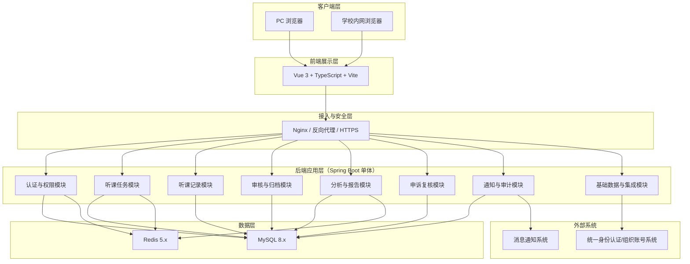
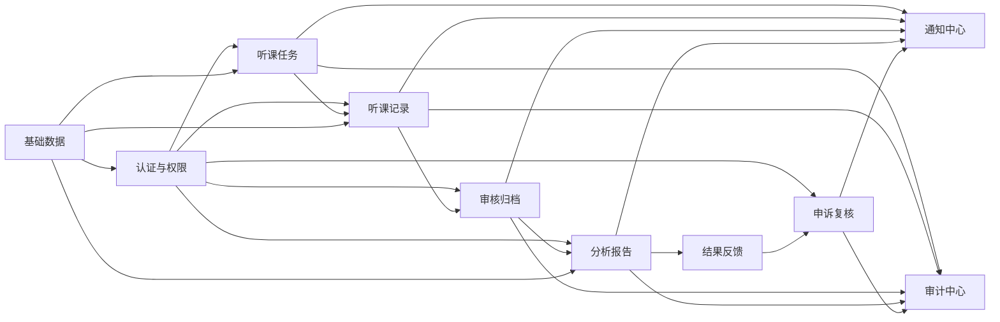
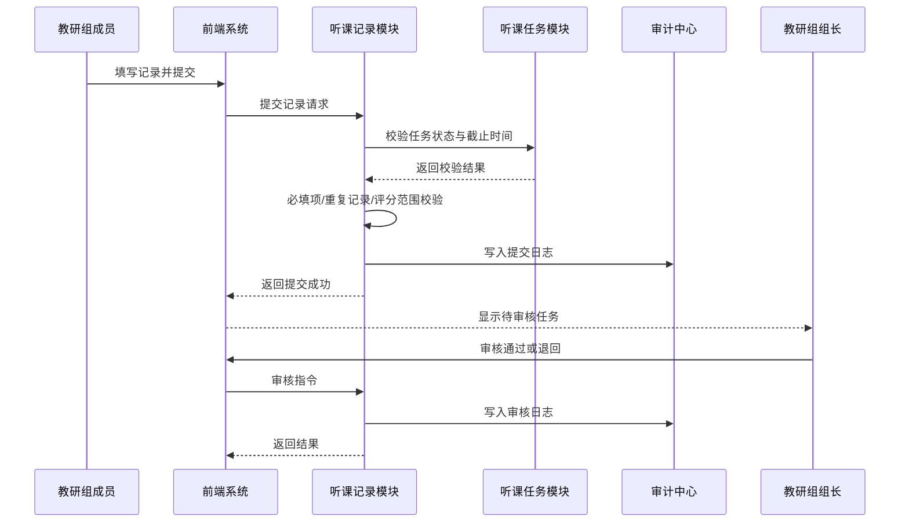
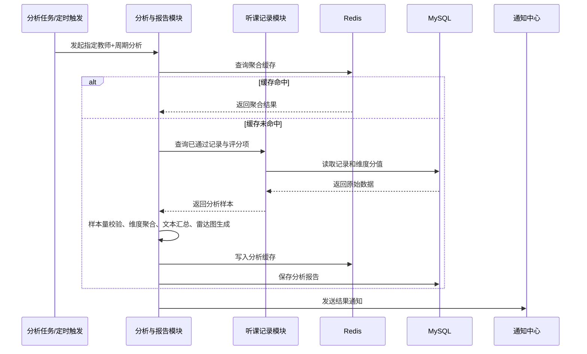
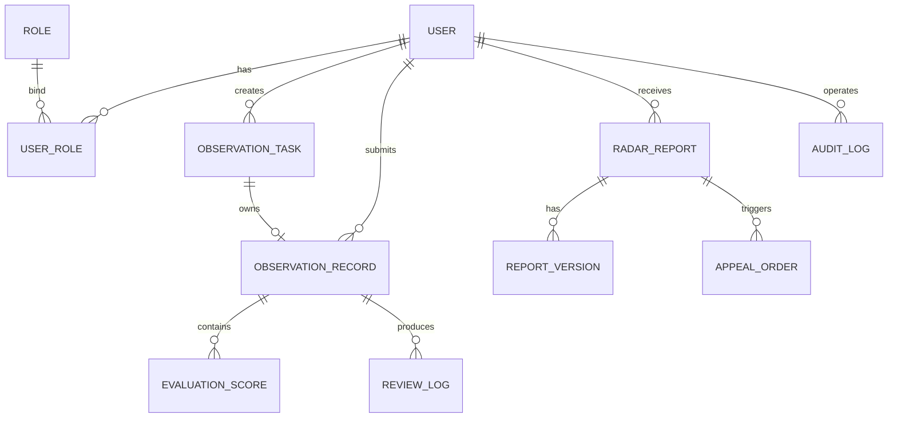
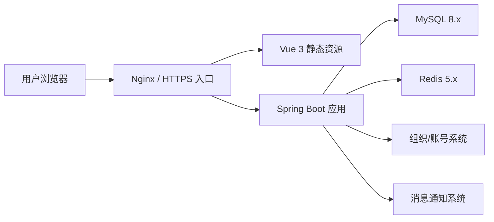

# 教师听课评课记录与分析系统系统架构设计文档

**文档标识**：SAD-TObserver-V1.0  
**编写日期**：2026-04-18  
**适用项目**：教师听课评课记录与分析系统  
**对应需求文档**：`教师听课评课记录与分析系统需求规格说明书`  
**技术路线**：Spring Boot、MyBatis、Vue 3、MySQL、Redis

## 一、引言

### 1. 编写目的

本文档用于描述“教师听课评课记录与分析系统”的系统架构设计方案，明确系统的总体结构、模块职责、数据架构、部署方式、接口策略及关键质量属性实现方案，为后续详细设计、编码实现、测试验证和部署运维提供统一依据。

### 2. 设计范围

本文档覆盖以下内容：

1. 系统总体架构与分层设计。  
2. 核心业务模块拆分与职责边界。  
3. 前后端技术架构与工程组织方式。  
4. 数据存储、缓存、审计和分析架构。  
5. 部署拓扑、接口交互、安全与性能设计。  
6. 需求到模块的映射关系。  

本文档不展开数据库字段级详细 DDL、UI 高保真界面和测试用例细节。

### 3. 参考资料

1. 《教师听课评课记录与分析系统需求规格说明书》V1.0。  
2. IEEE Std 830-1998。  
3. 项目现有工程结构：`t-observer-server`、`t-observer-web`。  
4. 项目根目录 `pom.xml` 与前端 `package.json`。  

### 4. 术语说明

本文档术语沿用需求规格说明书，包括：听课任务、听课记录单、评课维度、优点项、待改进项、教学能力雷达图、申诉复核、审计日志等。

## 二、架构驱动因素

### 1. 业务驱动

系统围绕“任务发布 -> 听课填报 -> 审核退回/通过 -> 汇总分析 -> 结果发布 -> 申诉复核 -> 周期归档”的业务闭环展开，核心目标如下：

1. 支撑教研组组长组织听课活动并跟踪执行进度。  
2. 支撑教研组成员快速完成结构化听课记录填报。  
3. 支撑系统基于已审核通过数据进行自动汇总与雷达图生成。  
4. 支撑被听课教师查看分析结果并在时限内发起申诉。  
5. 支撑学校管理者查看统计报表并导出结果。  

### 2. 关键功能驱动

依据需求规格说明书，架构必须重点支撑以下高优先级能力：

1. 统一登录与基于角色的访问控制。  
2. 听课任务的创建、分配、跟踪与状态流转。  
3. 听课记录草稿保存、校验、去重与提交。  
4. 组长审核、退回原因记录与通过确认。  
5. 优点项、待改进项和维度评分的聚合分析。  
6. 教学能力雷达图与分析报告生成。  
7. 消息提醒、审计追踪与历史归档。  

### 3. 质量属性驱动

根据非功能需求，架构设计重点满足以下指标：

1. 性能：95% 页面请求响应时间不超过 2 秒。  
2. 并发：支持不少于 300 名并发在线用户。  
3. 可用性：月度可用性不低于 99.5%。  
4. 安全性：全链路 HTTPS、基于角色授权、敏感字段脱敏。  
5. 审计性：关键操作日志保留不少于 1 年。  
6. 可维护性：需求、接口、模块、测试之间可追踪。  

### 4. 约束与假设

1. 系统采用前后端分离架构。  
2. 后端基于 Spring Boot 单体应用实现，采用模块化分层组织。  
3. 数据持久化使用 MySQL，热点数据和会话缓存使用 Redis。  
4. 用户、角色、组织等基础数据由学校统一系统提供，本系统通过标准接口接入。  
5. 结果通知系统为外部服务，本系统只负责调用通知接口和记录发送结果。  
6. 当前代码仓库仍处于工程骨架阶段，本文档描述的是目标实现架构。  

## 三、总体架构设计

### 1. 架构风格

本系统采用“前后端分离 + 模块化单体 + 分层架构”设计。

选择该架构的原因如下：

1. 业务规模中等，核心流程集中，采用单体架构可降低开发和部署复杂度。  
2. 听课任务、记录审核、分析报告和申诉复核之间事务关联紧密，更适合先在一个后端应用内完成协同。  
3. 通过模块化分层设计保留后续拆分服务的演进空间。  
4. 符合当前仓库结构与技术栈现状：`Spring Boot + Vue 3`。  

### 2. 总体架构图



### 3. 分层设计

系统逻辑上划分为五层：

| 层次    | 组成                             | 主要职责                         |
| ----- | ------------------------------ | ---------------------------- |
| 展示层   | Vue 页面、路由、状态管理、图表组件            | 页面展示、输入校验、权限菜单、交互编排          |
| 接口层   | Controller、DTO、参数校验、统一响应       | 对外提供 REST API，处理鉴权、参数转换和异常返回 |
| 应用层   | Application Service、流程编排、事务控制  | 协调领域对象、执行业务流程、控制状态流转         |
| 领域层   | Entity、Domain Service、业务规则、状态机 | 封装任务、记录、审核、申诉、报告等核心业务规则      |
| 基础设施层 | Mapper、Redis、第三方接口适配器、日志       | 数据访问、缓存、外部系统集成、文件导出、审计落库     |

### 4. 核心设计原则

1. 高内聚低耦合：按业务域拆分模块，而不是按技术功能简单堆叠。  
2. 单向依赖：展示层依赖应用层，应用层依赖领域层与基础设施层。  
3. 状态显式化：任务状态、记录状态、申诉状态必须使用枚举和状态机控制。  
4. 规则前置校验：提交、退回、审核通过、申诉受理前统一执行规则校验。  
5. 关键操作可追踪：所有状态变更和导出操作记录审计日志。  
6. 数据分级存储：事务数据存 MySQL，热点查询与临时态存 Redis。  

## 四、业务架构设计

### 1. 业务模块划分

| 模块    | 子模块                   | 主要职责                   |
| ----- | --------------------- | ---------------------- |
| 认证与权限 | 登录鉴权、角色授权、菜单权限、会话管理   | 接入统一身份认证，加载角色权限，控制访问范围 |
| 基础数据  | 用户同步、组织同步、评课维度字典、学科字典 | 提供用户、组织、维度等主数据支撑       |
| 听课任务  | 任务创建、任务分配、进度跟踪、逾期标记   | 管理任务生命周期和成员执行状态        |
| 听课记录  | 草稿保存、重复校验、提交、补录       | 维护记录正文、评分项和附件信息        |
| 审核归档  | 审核通过、退回修改、归档处理        | 确保记录质量并形成正式样本          |
| 分析报告  | 评分聚合、文本汇总、雷达图、报告导出    | 输出教师和周期维度的分析结论         |
| 结果反馈  | 结果发布、教师查看、确认回执        | 将分析结果发布给被听课教师          |
| 申诉复核  | 申诉提交、复核处理、版本保留        | 支撑争议处理和修正重发            |
| 通知中心  | 临期提醒、逾期提醒、结果通知        | 与消息系统对接并发送通知           |
| 审计中心  | 操作日志、状态轨迹、导出日志        | 满足审计合规和问题追踪要求          |

### 2. 业务模块关系图



### 3. 关键业务流程时序

#### 3.1 听课记录提交与审核



#### 3.2 汇总分析与雷达图生成



## 五、应用架构设计

### 1. 后端架构设计

后端采用 Spring Boot 单体应用，内部使用模块化分层结构，推荐包结构如下：

```text
com.edu.tobserver
├─ common                # 通用返回体、异常、枚举、工具类
├─ config                # Web、MyBatis、Redis、安全、跨域配置
├─ auth                  # 认证、授权、用户上下文
├─ masterdata            # 用户/组织/维度等基础数据
├─ task                  # 听课任务领域
├─ record                # 听课记录与评分领域
├─ review                # 审核退回与归档领域
├─ report                # 聚合分析、雷达图、导出
├─ appeal                # 申诉与复核
├─ notice                # 消息通知
├─ audit                 # 审计日志
└─ integration           # 外部系统适配器
```

每个业务模块内部继续按以下结构组织：

```text
模块名
├─ controller
├─ dto
├─ service
├─ domain
├─ mapper
└─ model
```

### 2. 前端架构设计

前端基于 Vue 3 + TypeScript + Vite，建议按“页面、组件、接口、状态、类型”组织：

```text
src
├─ api                   # Axios 封装与业务接口
├─ assets                # 静态资源
├─ components            # 公共组件
├─ layouts               # 页面布局
├─ router                # 路由表与路由守卫
├─ stores                # Pinia 状态管理
├─ types                 # TS 类型声明
├─ utils                 # 工具函数
└─ views
   ├─ login
   ├─ task
   ├─ record
   ├─ review
   ├─ report
   ├─ appeal
   └─ admin
```

前端职责如下：

1. 提供按角色加载的菜单与页面路由。  
2. 在提交前完成基础表单校验，提高交互效率。  
3. 调用后端 REST API 获取任务、记录、报告和报表数据。  
4. 使用图表组件渲染教学能力雷达图和趋势统计图。  
5. 对退回原因、逾期原因、申诉说明等进行友好展示。  

### 3. 典型页面与模块对应关系

| 页面      | 前端视图模块         | 后端业务模块    |
| ------- | -------------- | --------- |
| 登录页     | `views/login`  | 认证与权限     |
| 任务列表页   | `views/task`   | 听课任务      |
| 听课记录填写页 | `views/record` | 听课记录      |
| 审核页     | `views/review` | 审核归档      |
| 分析页     | `views/report` | 分析报告      |
| 申诉页     | `views/appeal` | 申诉复核      |
| 统计报表页   | `views/admin`  | 分析报告、审计中心 |

## 六、数据架构设计

### 1. 数据存储策略

| 数据类型                   | 存储介质          | 说明                |
| ---------------------- | ------------- | ----------------- |
| 用户、任务、记录、评分、报告、申诉、日志   | MySQL         | 核心业务持久化数据，保证事务一致性 |
| 登录态、权限缓存、维度字典缓存、热点分析结果 | Redis         | 提升读取性能，降低数据库压力    |
| 导出文件路径或对象存储地址          | MySQL/文件服务元数据 | 可按部署条件扩展为对象存储     |

### 2. 核心实体设计

基于需求规格说明书，系统至少包含以下核心实体：

1. 用户 `user`。  
2. 角色 `role`。  
3. 用户角色关联 `user_role`。  
4. 教研组/组织 `org_unit`。  
5. 评课维度字典 `evaluation_dimension`。  
6. 听课任务 `observation_task`。  
7. 听课记录 `observation_record`。  
8. 记录评分明细 `evaluation_score`。  
9. 审核记录 `review_log`。  
10. 分析报告 `radar_report`。  
11. 报告版本 `report_version`。  
12. 申诉单 `appeal_order`。  
13. 通知发送记录 `notice_log`。  
14. 审计日志 `audit_log`。  

### 3. 逻辑数据模型



### 4. 关键表设计说明

| 表名                   | 关键字段                                                                              | 说明        |
| -------------------- | --------------------------------------------------------------------------------- | --------- |
| `observation_task`   | `task_id`、`leader_id`、`observer_id`、`teacher_id`、`lesson_date`、`status`           | 听课任务主表    |
| `observation_record` | `record_id`、`task_id`、`record_status`、`strengths`、`weaknesses`、`suggestions`      | 听课记录正文    |
| `evaluation_score`   | `score_id`、`record_id`、`dimension_code`、`score_value`                             | 记录评分明细    |
| `radar_report`       | `report_id`、`teacher_id`、`period`、`radar_json`、`conclusion`                       | 汇总分析结果    |
| `appeal_order`       | `appeal_id`、`report_id`、`teacher_id`、`status`、`reason`                            | 申诉与复核过程单据 |
| `audit_log`          | `log_id`、`biz_type`、`biz_id`、`operator_id`、`operation`、`before_json`、`after_json` | 审计追踪      |

### 5. 数据完整性与约束设计

1. 对 `(observer_id, lesson_instance)` 建立唯一约束，防止重复提交有效记录。  
2. 对 `record_status`、`task_status`、`appeal_status` 使用枚举字典控制合法值。  
3. 对评分明细使用 `(record_id, dimension_code)` 唯一约束，防止同一维度重复评分。  
4. 对雷达图报告使用 `(teacher_id, period, version_no)` 形成版本化管理。  
5. 所有状态变更操作必须在同一事务中同时写入业务表和审计日志表。  

### 6. 索引设计

| 表名                   | 推荐索引                                                      | 目标            |
| -------------------- | --------------------------------------------------------- | ------------- |
| `observation_task`   | `idx_task_observer_status`、`idx_task_teacher_period`      | 支撑任务列表和教师维度查询 |
| `observation_record` | `uk_record_unique_submit`、`idx_record_status_submit_time` | 支撑重复校验和待审核列表  |
| `evaluation_score`   | `idx_score_record_id`、`idx_score_dimension`               | 支撑汇总分析        |
| `radar_report`       | `idx_report_teacher_period`                               | 支撑教师周期报告查询    |
| `audit_log`          | `idx_audit_biz`、`idx_audit_operator_time`                 | 支撑审计检索        |

## 七、接口架构设计

### 1. 接口设计原则

1. 采用 RESTful API 风格，统一使用 JSON 作为交互格式。  
2. 统一响应结构，包含 `code`、`message`、`data`、`traceId`。  
3. 所有写操作接口记录审计日志。  
4. 关键业务接口进行幂等控制，防止重复提交。  
5. 内外部接口调用均记录链路日志，便于排障。  

### 2. 主要内部 API 规划

| 模块    | 方法     | 路径                                | 说明           |
| ----- | ------ | --------------------------------- | ------------ |
| 认证与权限 | `POST` | `/api/auth/login`                 | 登录并获取令牌或会话信息 |
| 认证与权限 | `GET`  | `/api/auth/me`                    | 获取当前用户信息和权限  |
| 听课任务  | `POST` | `/api/tasks`                      | 创建听课任务       |
| 听课任务  | `GET`  | `/api/tasks`                      | 分页查询任务列表     |
| 听课记录  | `POST` | `/api/records/draft`              | 保存草稿         |
| 听课记录  | `POST` | `/api/records/{id}/submit`        | 提交听课记录       |
| 审核归档  | `POST` | `/api/reviews/{recordId}/approve` | 审核通过         |
| 审核归档  | `POST` | `/api/reviews/{recordId}/return`  | 退回并附原因       |
| 分析报告  | `POST` | `/api/reports/generate`           | 生成分析报告       |
| 分析报告  | `GET`  | `/api/reports`                    | 查询报告列表       |
| 分析报告  | `GET`  | `/api/reports/{id}/export`        | 导出 PDF/文档    |
| 申诉复核  | `POST` | `/api/appeals`                    | 提交申诉         |
| 审计中心  | `GET`  | `/api/audits`                     | 查询审计日志       |

### 3. 外部集成接口

| 外部系统     | 方向    | 说明                  |
| -------- | ----- | ------------------- |
| 统一身份认证系统 | 入站/出站 | 用户登录认证、用户信息拉取、角色映射  |
| 组织与账号系统  | 出站    | 同步组织架构、教师基础资料、教研组关系 |
| 消息通知系统   | 出站    | 发送临期提醒、逾期通知、结果发布通知  |

### 4. 接口安全策略

1. 所有 API 通过 HTTPS 访问。  
2. 登录后基于令牌或会话进行身份识别。  
3. 采用 RBAC 进行接口授权，必要时叠加数据权限过滤。  
4. 对导出接口、审核接口、申诉复核接口进行细粒度权限控制。  
5. 对输入参数进行 Bean Validation 和服务端业务校验。  

## 八、缓存与异步设计

### 1. Redis 使用场景

| 场景    | 缓存内容           | 目的            |
| ----- | -------------- | ------------- |
| 登录与权限 | 用户会话、菜单权限、角色权限 | 减少重复鉴权开销      |
| 字典缓存  | 评课维度、角色字典、组织字典 | 降低主数据查询频率     |
| 分析缓存  | 教师周期报告聚合结果     | 提升分析页与报告页响应速度 |
| 幂等控制  | 提交记录、审核操作幂等键   | 防止重复请求        |

### 2. 异步处理设计

以下场景建议采用异步执行：

1. 结果通知发送。  
2. 报告导出生成。  
3. 周期性逾期扫描与提醒。  
4. 分析结果预计算和缓存刷新。  

实现方式建议：

1. 首版可基于 Spring 任务调度和应用内异步线程池实现。  
2. 若后续通知量和分析量增大，可平滑演进到消息队列方案。  

## 九、部署架构设计

### 1. 部署拓扑



### 2. 部署说明

1. 前端打包后部署为静态资源，由 Nginx 承载。  
2. 后端以单个 Spring Boot 应用部署，可采用 Jar 或 Docker 方式运行。  
3. MySQL 部署主库，按学校环境可选主从备份。  
4. Redis 采用单实例或哨兵模式，承载缓存与临时态数据。  
5. 系统入口统一由 Nginx 提供 HTTPS、反向代理和静态资源服务。  

### 3. 环境规划建议

| 环境    | 说明                     |
| ----- | ---------------------- |
| 开发环境  | 本地前后端分离启动，连接开发库和 Redis |
| 测试环境  | 模拟完整业务链路和外部系统联调        |
| 预发布环境 | 接近正式部署拓扑，执行验收测试        |
| 生产环境  | HTTPS、备份、监控、日志归档全部开启   |

## 十、安全架构设计

### 1. 身份认证与授权

1. 优先对接学校统一身份认证。  
2. 系统内部完成角色映射与权限装载。  
3. 使用 RBAC 控制菜单、页面按钮和后端接口访问。  
4. 对教师仅开放本人相关报告和申诉数据。  
5. 对管理者开放聚合报表，不开放原始隐私文本明细。  

### 2. 数据安全

1. 敏感信息在前端脱敏展示，例如手机号、工号等。  
2. `radar_json` 只保存聚合结果，不存储个人隐私文本。  
3. 审计日志保留操作前后快照，敏感字段按规则脱敏。  
4. 导出操作必须记录操作人、时间、对象和导出类型。  

### 3. 安全防护

1. 防止未授权访问：路由守卫 + 接口鉴权。  
2. 防止参数污染和非法输入：后端参数白名单与校验注解。  
3. 防止重复提交：提交接口加幂等键和状态判断。  
4. 防止越权查看：所有查询接口按当前用户角色和数据范围过滤。  

## 十一、性能与可用性设计

### 1. 性能设计

为满足“95% 页面请求响应时间不超过 2 秒”的目标，系统采用以下策略：

1. 任务列表、报告列表等查询接口采用分页查询。  
2. 热点字典和分析结果使用 Redis 缓存。  
3. 汇总分析采用预计算与结果复用，避免每次页面打开都全量聚合。  
4. 数据库针对高频查询条件建立联合索引。  
5. 导出、通知等非核心链路改为异步处理。  

### 2. 可用性设计

为满足“月度可用性不低于 99.5%”，系统采用以下策略：

1. 前后端解耦部署，前端静态资源可独立发布。  
2. 应用日志、错误日志、审计日志分级管理。  
3. MySQL 和 Redis 定期备份。  
4. 外部接口调用失败时具备重试与降级提示能力。  
5. 分析样本不足时优雅降级为文字反馈，不阻塞主流程。  

### 3. 可维护性设计

1. 按业务模块组织代码，降低耦合。  
2. 使用统一异常处理、统一返回体和统一日志规范。  
3. 保留需求编号到模块、接口、测试的追踪关系。  
4. 核心状态机和业务规则集中管理，避免散落在页面和 SQL 中。  

## 十二、审计与日志设计

### 1. 审计范围

以下操作必须写入审计日志：

1. 登录成功与失败。  
2. 听课任务创建、修改、撤销、分配。  
3. 记录草稿保存、提交、补录。  
4. 审核通过、退回、归档。  
5. 报告生成、重新发布、导出。  
6. 申诉提交、复核、修正。  

### 2. 日志内容

审计日志建议包含以下字段：

1. 业务类型。  
2. 业务主键。  
3. 操作人。  
4. 操作时间。  
5. 操作动作。  
6. 操作前快照。  
7. 操作后快照。  
8. 来源 IP、终端信息、请求链路号。  

## 十三、需求到架构映射

| 需求编号          | 对应模块            | 对应架构机制             |
| ------------- | --------------- | ------------------ |
| FR-01 用户登录与鉴权 | 认证与权限、基础数据      | SSO 对接、RBAC、会话缓存   |
| FR-02 听课任务管理  | 听课任务、通知中心、审计中心  | 任务生命周期管理、提醒通知、操作留痕 |
| FR-03 听课记录填报  | 听课记录、基础数据       | 表单校验、评分明细、维度字典     |
| FR-04 记录草稿与提交 | 听课记录、Redis、审计中心 | 草稿保存、幂等控制、提交日志     |
| FR-05 审核与退回   | 审核归档、通知中心、审计中心  | 状态机、退回原因校验、审核通知    |
| FR-06 自动汇总分析  | 分析报告、Redis      | 聚合计算、文本汇总、缓存复用     |
| FR-07 雷达图生成   | 分析报告            | 维度聚合算法、图表数据生成      |
| FR-08 结果发布    | 结果反馈、通知中心       | 报告发布、结果通知          |
| FR-09 申诉复核    | 申诉复核、审计中心       | 申诉时限校验、版本保留        |
| FR-10 统计报表    | 分析报告            | 趋势查询、导出能力          |
| FR-11 消息提醒    | 通知中心            | 临期、逾期、发布事件通知       |
| FR-12 审计追踪    | 审计中心            | 全量关键操作留痕           |

## 十四、实现优先级与演进建议

### 1. 首版实现范围

结合需求验收标准，首版优先交付以下内容：

1. 登录鉴权与角色权限。  
2. 听课任务管理。  
3. 听课记录草稿、提交、退回、审核通过。  
4. 自动汇总分析与雷达图生成。  
5. 审计日志。  

### 2. 二期增强方向

1. 完善申诉复核闭环。  
2. 增强统计报表和导出模板。  
3. 增加通知模板管理与消息重发能力。  
4. 根据负载情况引入消息队列或拆分分析服务。  

### 3. 架构演进路径

首版以模块化单体为主，后续可按边界逐步拆分：

1. 通知中心可独立为消息服务。  
2. 分析报告模块可独立为异步分析服务。  
3. 统一认证和主数据同步可收敛到独立集成层。  

## 十五、结论

本架构设计以需求规格说明书为核心依据，结合当前项目仓库的技术栈和工程现状，确定采用“前后端分离 + 模块化单体 + 分层架构”的实现方案。该方案能够较好支撑听课评课业务闭环、审计追踪、汇总分析和雷达图生成等核心需求，同时兼顾实现成本、部署复杂度和后续演进能力，适合作为本项目的系统架构基线。
