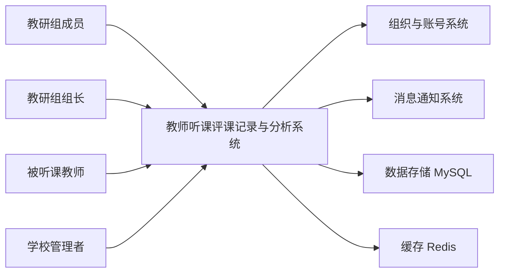
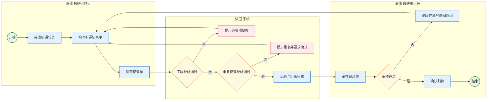
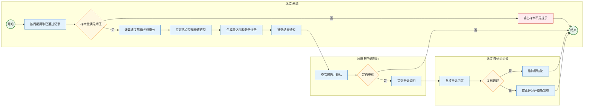
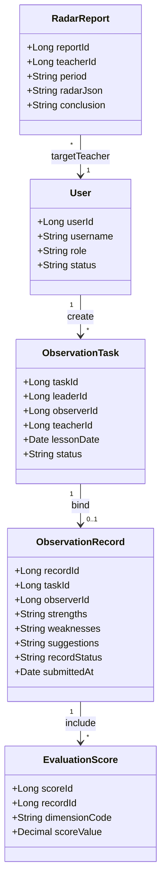
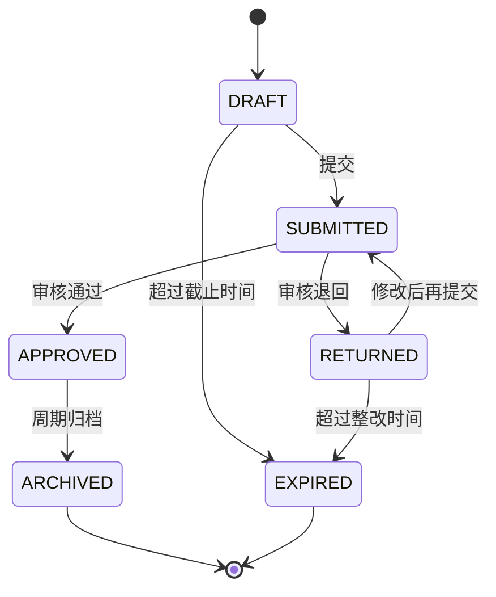

# 教师听课评课记录与分析系统需求规格说明书

**文档标识**：SRS-TObserver-V1.0  
**编写日期**：2026-04-16  
**适用标准**：IEEE 830-1998  
**技术路线**：Spring Boot、Vue 3、MySQL、Redis

## 一、引言

### 1. 编写目的

本文档用于定义“教师听课评课记录与分析系统”的功能边界、业务规则和质量要求。本文档面向产品负责人、开发人员、测试人员和项目评审人员。本文档也是设计、开发、测试和验收的统一依据。

### 2. 范围

本系统服务于教研组听课评课场景。系统支持听课任务发布、听课记录填写、评课意见汇总、教学能力雷达图生成与结果归档。

本系统不包含排课引擎、学籍管理和教学资源管理。系统通过标准接口接入现有用户与组织数据。

### 3. 定义

| 中文术语    | English Term              | 业务定义                          |
| ------- | ------------------------- | ----------------------------- |
| 听课      | Classroom Observation     | 教研成员对目标教师课堂教学过程进行结构化观察的活动。    |
| 评课      | Lesson Evaluation         | 基于听课记录对课堂教学进行质量评价与改进建议输出的活动。  |
| 听课任务    | Observation Task          | 指定听课人、被听课人、课程和时间窗口的业务任务。      |
| 听课记录单   | Observation Record        | 听课人填写的结构化表单，包含评分、优点、问题和建议。    |
| 评课维度    | Evaluation Dimension      | 用于评价教学能力的指标项，如教学设计、课堂组织、互动反馈。 |
| 优点项     | Strength Item             | 从评课文本中提取并归档的积极表现条目。           |
| 待改进项    | Weakness Item             | 从评课文本中提取并归档的改进条目。             |
| 教学能力雷达图 | Teaching Competency Radar | 基于维度分值生成的可视化能力画像。             |
| 教研组     | Teaching Research Group   | 学校内按学科或年级组织的教学研究团队。           |
| 组长      | Group Leader              | 负责任务分配、质量审核和结果确认的教研组负责人。      |
| 普通成员    | Member                    | 执行听课与评课填报的教研组成员。              |
| 被听课教师   | Observed Teacher          | 被观察并接收评课反馈的目标教师。              |
| 草稿      | Draft                     | 听课记录未提交前的编辑状态。                |
| 已提交     | Submitted                 | 听课记录完成提交并等待审核的状态。             |
| 已退回     | Returned                  | 审核未通过并要求修改的状态。                |
| 已通过     | Approved                  | 审核通过并可参与汇总分析的状态。              |
| 已归档     | Archived                  | 流程完成后不可编辑的状态。                 |

### 4. 参考资料

1. IEEE Std 830-1998，Software Requirements Specification。  
2. OMG BPMN 2.0 Specification。  
3. 项目课题说明：“基于 SpringBoot 和 Vue3 的教师听课评课记录与分析系统的设计与实现”。  
4. 技术项目文档书写规范（项目内部规范）。

## 二、项目概述

### 1. 产品描述

本系统定位为教学质量改进支持平台。系统围绕“记录、分析、反馈、改进”闭环运行。系统通过结构化数据沉淀与可视化分析，帮助教研组形成持续改进机制。

系统上下文图如下。

### 2. 产品功能

1. 用户与角色管理。  
2. 听课任务创建、分配与跟踪。  
3. 听课记录填写、保存草稿与提交。  
4. 组长审核、退回修改与通过确认。  
5. 优点项和待改进项自动汇总。  
6. 多维评分计算与教学能力雷达图生成。  
7. 历史记录检索、统计报表与导出。  
8. 结果通知、进度提醒与逾期预警。

### 3. 用户特征

| 角色    | 主要目标          | 关键权限                |
| ----- | ------------- | ------------------- |
| 教研组组长 | 组织听课活动并保证数据质量 | 创建任务、审核记录、发布分析结果    |
| 教研组成员 | 快速完成听课记录和评课建议 | 接收任务、填写记录、查看个人提交历史  |
| 被听课教师 | 接收反馈并跟踪改进     | 查看汇总意见、查看雷达图、提交申诉说明 |
| 学校管理者 | 观察群体教学质量趋势    | 查看统计报表、导出分析结果       |

### 4. 运行环境

1. 前端：Vue 3、TypeScript、Vite，主流现代浏览器。  
2. 后端：Spring Boot，RESTful API。  
3. 数据库：MySQL 8.x。  
4. 缓存：Redis 5.x。  
5. 部署：Linux 或 Windows Server，支持 Docker 部署。

### 5. 约束与依赖

1. 系统必须采用前后端分离架构。  
2. 系统必须支持基于角色的访问控制。  
3. 系统必须保留听课记录全量审计日志。  
4. 系统依赖学校组织架构与用户基础数据。  
5. 雷达图算法依赖已通过审核的数据样本。

## 三、业务需求

### 1. 功能简介

| 编号    | 需求名称    | 描述                     | 优先级 |
| ----- | ------- | ---------------------- | --- |
| FR-01 | 用户登录与鉴权 | 用户通过统一身份认证登录系统并获取角色权限。 | 高   |
| FR-02 | 听课任务管理  | 组长创建任务并分配给成员，系统跟踪任务状态。 | 高   |
| FR-03 | 听课记录填报  | 成员按模板填写评分、优点、待改进项和建议。  | 高   |
| FR-04 | 记录草稿与提交 | 成员可保存草稿并在截止前提交记录。      | 高   |
| FR-05 | 审核与退回   | 组长审核记录，支持通过或退回并附原因。    | 高   |
| FR-06 | 自动汇总分析  | 系统按教师、学科、周期汇总优点和待改进项。  | 高   |
| FR-07 | 雷达图生成   | 系统按评价维度计算分值并生成雷达图。     | 高   |
| FR-08 | 结果发布    | 系统向被听课教师发布分析报告和改进建议。   | 中   |
| FR-09 | 申诉复核    | 被听课教师可在时限内提交申诉并触发复核。   | 中   |
| FR-10 | 统计报表    | 管理者可查看趋势统计并导出标准报表。     | 中   |
| FR-11 | 消息提醒    | 系统在临期、逾期和结果发布时发送通知。    | 中   |
| FR-12 | 审计追踪    | 系统记录关键操作日志并支持按条件检索。    | 中   |

### 2. 流程图

#### 2.1 听课记录提交流程（BPMN 2.0 语义）

异常流程说明。  

1. EX-01：字段校验失败时，系统标记缺失字段并阻止提交。  
2. EX-02：检测到重复记录时，系统提示重复原因并要求重新编辑。  
3. EX-03：审核不通过时，记录状态变更为“已退回”，成员必须修改后再次提交。

#### 2.2 评课汇总与雷达图流程（BPMN 2.0 语义）

异常流程说明。  

1. EX-04：样本量不足时，系统不生成雷达图，仅生成“数据不足”提示。  
2. EX-05：申诉超过受理时限时，系统自动拒绝并记录原因。  
3. EX-06：复核修正后，系统保留修正前后版本并生成审计日志。

### 3. 业务规则与异常流程

| 编号    | 业务规则                      | 异常流程（Exception Flow）        |
| ----- | ------------------------- | --------------------------- |
| BR-01 | 听课记录须在听课结束后 48 小时内提交。     | 超时后状态置为“逾期”，成员可补录并必须填写逾期原因。 |
| BR-02 | 同一听课人对同一课程实例只能提交 1 份有效记录。 | 出现重复时系统拒绝提交并给出重复记录编号。       |
| BR-03 | 每份记录必须包含评分、优点项、待改进项和建议。   | 缺少任一必填项时系统阻止提交并高亮字段。        |
| BR-04 | 评分范围为 1 到 5，精度为 0.5。      | 超出范围时系统拒绝保存并提示合法区间。         |
| BR-05 | 雷达图生成最小样本量为 3 条已通过记录。     | 样本不足时仅展示文字反馈，不展示雷达图。        |
| BR-06 | 退回记录必须附带明确退回原因。           | 未填写退回原因时系统禁止执行退回动作。         |
| BR-07 | 被听课教师可在结果发布后 7 天内申诉。      | 超过时限时系统拒绝申诉并记录超时标记。         |
| BR-08 | 所有状态变更必须写入审计日志。           | 写日志失败时事务回滚并提示管理员处理。         |

### 4. 数据项描述

核心数据模型如下。

主要数据项说明如下。

| 数据项            | 类型           | 说明      | 约束                                                    |
| -------------- | ------------ | ------- | ----------------------------------------------------- |
| user_id        | bigint       | 用户主键    | 必填，唯一                                                 |
| role_code      | varchar(32)  | 角色编码    | 枚举：LEADER、MEMBER、TEACHER、ADMIN                        |
| task_id        | bigint       | 听课任务主键  | 必填，唯一                                                 |
| lesson_date    | datetime     | 听课日期时间  | 不得晚于当前系统时间                                            |
| record_id      | bigint       | 听课记录主键  | 必填，唯一                                                 |
| record_status  | varchar(32)  | 记录状态    | 枚举：DRAFT、SUBMITTED、RETURNED、APPROVED、ARCHIVED、EXPIRED |
| strengths      | text         | 优点项文本   | 至少 1 条有效内容                                            |
| weaknesses     | text         | 待改进项文本  | 至少 1 条有效内容                                            |
| suggestions    | text         | 改进建议文本  | 长度不超过 2000 字                                          |
| dimension_code | varchar(32)  | 评课维度编码  | 必须在维度字典中存在                                            |
| score_value    | decimal(2,1) | 维度分值    | 取值 1.0 到 5.0，步长 0.5                                   |
| report_id      | bigint       | 雷达图报告主键 | 必填，唯一                                                 |
| radar_json     | json         | 雷达图绘制数据 | 仅保存聚合结果，不保存个人隐私文本                                     |

### 5. 界面展示

#### 5.1 原型交互说明

| 页面      | 主要交互            | 输出结果          |
| ------- | --------------- | ------------- |
| 登录页     | 输入账号密码并登录       | 进入角色首页，加载权限菜单 |
| 任务列表页   | 按状态筛选任务，点击“去填报” | 跳转到听课记录填写页    |
| 听课记录填写页 | 填写评分与文本，保存草稿或提交 | 保存草稿或创建提交版本   |
| 审核页     | 组长查看详情，执行通过或退回  | 变更记录状态并通知提交人  |
| 分析页     | 选择教师和周期，点击生成分析  | 展示优缺点汇总与雷达图   |
| 报告页     | 查看结论并导出 PDF     | 下载分析报告并写入导出日志 |

#### 5.2 状态定义

听课记录状态机如下。

状态约束说明。  

1. 处于 `DRAFT` 和 `RETURNED` 状态的记录允许编辑。  
2. 处于 `SUBMITTED` 状态的记录不允许提交人编辑。  
3. 处于 `APPROVED` 和 `ARCHIVED` 状态的记录仅允许查询。  
4. 处于 `EXPIRED` 状态的记录仅允许按补录流程处理。

### 6. 非功能需求

| 编号     | 需求项  | 指标                    |
| ------ | ---- | --------------------- |
| NFR-01 | 性能   | 95% 的页面请求响应时间不超过 2 秒。 |
| NFR-02 | 并发   | 支持不少于 300 名并发在线用户。    |
| NFR-03 | 可用性  | 月度可用性不低于 99.5%。       |
| NFR-04 | 安全性  | 全链路 HTTPS，敏感字段脱敏展示。   |
| NFR-05 | 审计性  | 关键操作日志保留不少于 1 年。      |
| NFR-06 | 易用性  | 核心填报流程在 3 步内完成提交。     |
| NFR-07 | 可维护性 | 所有需求编号可追踪到接口与测试用例。    |

### 7. 验收标准

1. FR-01 到 FR-07 必须在首版验收中全部通过。  
2. 听课记录从创建到审核归档的全流程必须可闭环执行。  
3. 雷达图必须可按教师和周期稳定生成并可重复复现。  
4. 所有业务规则的异常流程必须可触发并可追踪日志。

## 四、附录

### 1. 原始需求

1. 教研组成员填写听课表。  
2. 系统汇总优点和待改进项。  
3. 系统生成教师教学能力雷达图。

### 2. 需求跟踪矩阵

| 原始需求      | 对应功能需求                  | 对应业务规则                  |
| --------- | ----------------------- | ----------------------- |
| 成员填写听课表   | FR-02、FR-03、FR-04、FR-05 | BR-01、BR-02、BR-03、BR-06 |
| 汇总优点和待改进项 | FR-06、FR-08             | BR-03、BR-05             |
| 生成教学能力雷达图 | FR-07、FR-10             | BR-04、BR-05、BR-08       |
